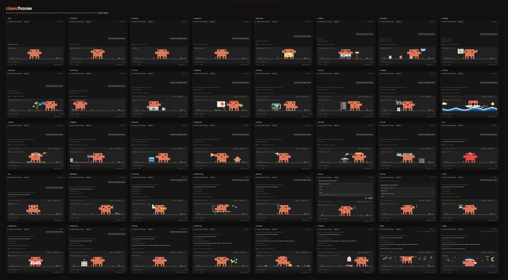

# clawdhouse



▶ [Watch Clawd run through every mood, one per beat](./media/clawd-beat.mp4) (36 s, with sound)

A pixel Clawd who keeps you company while [Claude Code](https://claude.com/claude-code) works. He sits on a small stage above the prompt (or in a side pane) and acts out what Claude is doing: thinking, reading files, editing, running tests, building, committing, browsing, waiting for your OK. He cheers when a turn finishes, sulks when it fails, and nods off after a minute and a half of quiet.

Everything is drawn in code (see `plugin/hooks/engine.ts`). There are no image files to download.

> clawdhouse is built on function hooks, an early-access Claude Code feature whose API may change between releases. It was built and tested on Claude Code 2.1.286.

## Install

Inside Claude Code:

```
/plugin marketplace add ishuagrawal/clawdhouse
/plugin install clawdhouse
```

Or from a shell:

```bash
claude plugin marketplace add ishuagrawal/clawdhouse
```

```bash
claude plugin install clawdhouse --config name=YourName
```

Start a new session (or run `/reload-plugins`) and Clawd shows up. Pull updates later with `claude plugin marketplace update clawdhouse`.

## Options

| Option | Default | What it does |
| --- | --- | --- |
| `name` | `friend` | What Clawd calls you in greetings and cheers. |

Pass `--config name=YourName` when installing from the shell, or change it later from the `/plugin` menu.

## Commands

| Command | What it does |
| --- | --- |
| `/clawd` | Show Clawd (or list what he can do) |
| `/clawd stage` | Put him above the prompt |
| `/clawd pane` | Move him into a side pane |
| `/clawd hide` | Give him a break |
| `/clawd <mood>` | Preview a mood, such as `/clawd testing` or `/clawd delegating 3` |
| `/clawd <reaction>` | Preview a reaction: `pass`, `fail`, `edit`, `found`, `none`, `hello`, `denied`, `phew`, `combo`, `noted`, `streak` |

Run `/clawd` with no arguments for the full list of moods.

## How it works

`plugin/hooks/register.tsx` hooks session, prompt, turn and tool events and maps each one to a mood: a `Bash` call running `npm test` becomes *testing*, an `Edit` becomes *writing*, a `git commit` becomes *committing*. It stores the mood in `$.state` and draws the stage with `ui.render` hooks for the `AbovePrompt` band and the `Pane`. `plugin/hooks/engine.ts` holds the sprite art, the tiny physics sim and the rasterizer that turns a frame into terminal cells or an SVG. In the terminal, `plugin/hooks/clawd.tsx` runs the animation as a client module. Surfaces that can't run one, like the desktop app, get frames stepped and drawn by the hooks module itself.

## Hack on it

Clone the repo and load the plugin straight from disk. Saving a file hot-reloads it in the running session.

```bash
git clone https://github.com/ishuagrawal/clawdhouse.git
```

```bash
claude --plugin-dir ./clawdhouse/plugin
```

In the desktop app, where you can't pass flags, add the folder to the `env` block of `~/.claude/settings.json` instead:

```json
{
  "env": {
    "CLAUDE_CODE_PLUGIN_DIRS": "/absolute/path/to/clawdhouse/plugin"
  }
}
```

If you also installed clawdhouse with `/plugin install`, disable that copy (`claude plugin disable clawdhouse`) so it doesn't load twice.

### Types, checks and tests

The first time Claude Code loads the plugin from your disk it writes the API's type declarations to `plugin/.claude-plugin/types/`. That folder is generated and git-ignored, and the plugin's `tsconfig.json` extends it, so load the plugin once before opening it in an editor.

```bash
claude plugin validate ./plugin
```

```bash
claude plugin test ./plugin
```

`validate` reads the manifest and hooks module the way the engine will and reports anything it would refuse. `test` runs `plugin/tests/*.test.ts` against the engine.

## Layout

```
.claude-plugin/marketplace.json   lets /plugin install find the plugin
plugin/
  .claude-plugin/plugin.json      name, version, options (userConfig)
  hooks/hooks.json                points at the hooks module
  hooks/register.tsx              exports register(on, options)
  hooks/engine.ts                 sprite art, physics sim, rasterizer
  types/index.d.ts                the plugin's $.state contract
  tests/*.test.ts                 claude plugin test
media/                            the promo image and video, rendered from the plugin's engine
```

## License

[MIT](./LICENSE)
